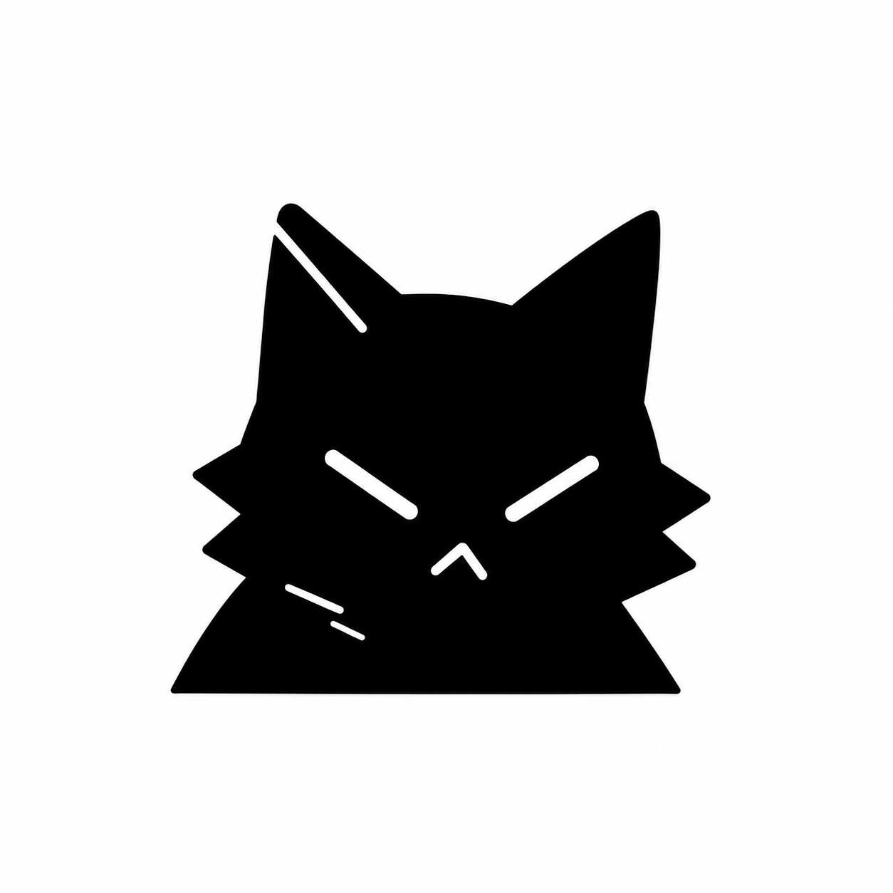
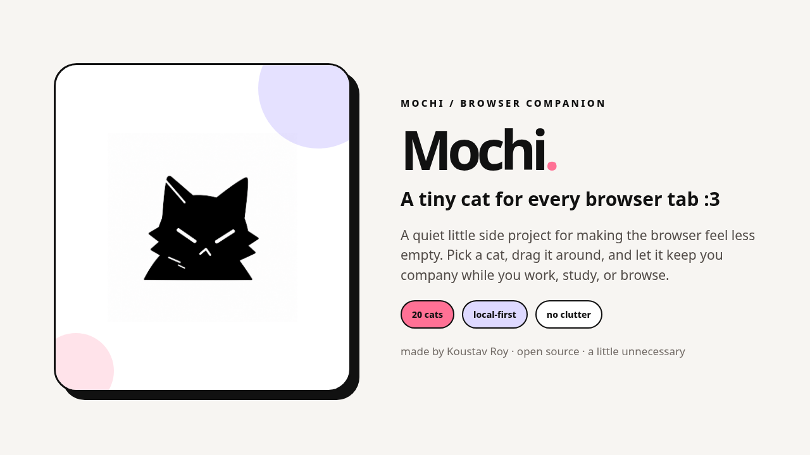
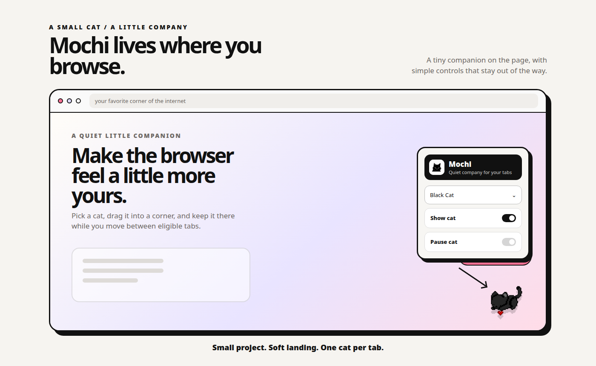
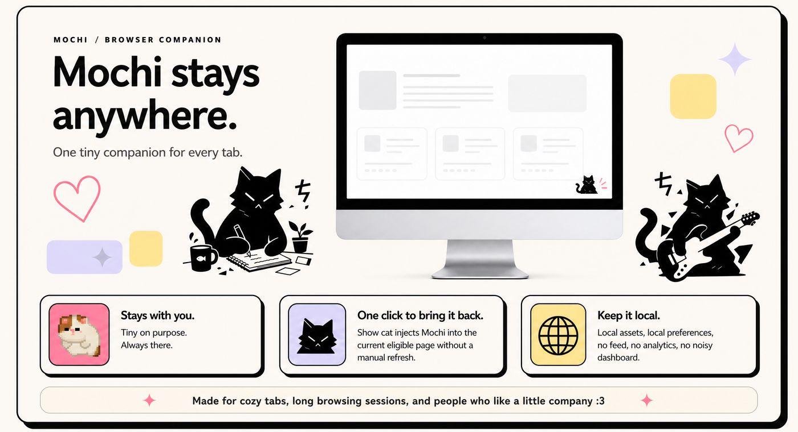
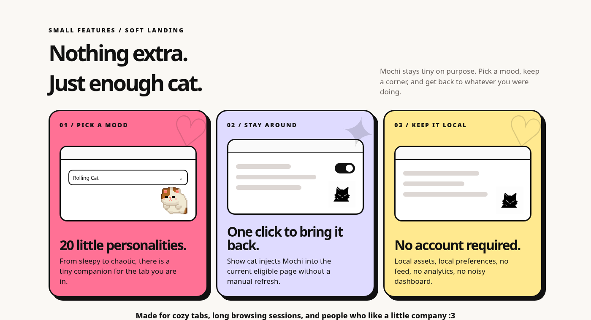
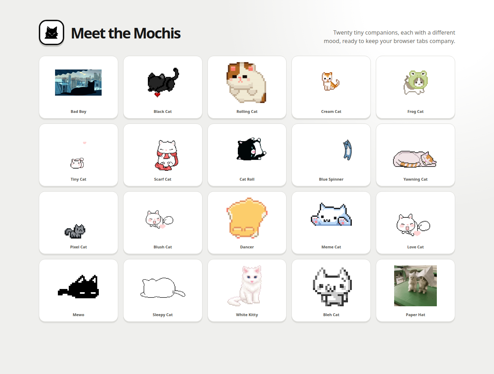

# Mochi

<p align="center">
  
</p>

<p align="center">
  <strong>A tiny cat for every browser tab :3</strong><br>
  A small, local-first browser companion for a slightly less sterile internet.
</p>

<p align="center">
  <a href="https://github.com/koustavdatascience/mochi">Repository</a> ·
  <a href="https://github.com/koustavdatascience/mochi/issues">Issues</a> ·
  <a href="https://github.com/koustavdatascience">Koustav Roy</a>
</p>

<p align="center">
  
  
</p>

## What is Mochi?

Mochi is a lightweight Chromium extension that places a tiny animated cat on the pages you browse. Pick a style, drag it into a corner, and let it quietly keep you company while you work, study, watch, or wander around the web.

<p align="center">
  
</p>

<p align="center">
  
</p>

## Quick start

1. Clone or download this repository.
2. Open `chrome://extensions/` in Chrome or Chromium, or `edge://extensions/` in Microsoft Edge.
3. Enable **Developer mode**.
4. Click **Load unpacked** and select the folder containing `manifest.json`.
5. Open a normal website, click the Mochi toolbar icon, choose a cat, and switch on **Show cat**.

The unpacked-extension workflow is documented by [Chrome][1], with a similar local-loading flow available for [Microsoft Edge][2].

## Use Mochi

Open the popup to choose a cat or toggle **Show cat** and **Pause cat**. Drag the cat on any eligible page to save its normalized position. Mochi broadcasts the selected style, visibility, pause state, and position across eligible tabs.

The extension also attempts to recover into already-open eligible tabs after startup, updates, tab activation, and page completion. Protected browser surfaces such as `chrome://extensions` and the Chrome Web Store cannot be injected by extensions.

## Cat styles

Mochi includes **Bad Boy, Black Cat, Rolling Cat, Cream Cat, Frog Cat, Tiny Cat, Scarf Cat, Cat Roll, Blue Spinner, Yawning Cat, Pixel Cat, Blush Cat, Dancer, Meme Cat, Love Cat, Mewo, Sleepy Cat, White Kitty, Bleh Cat, and Paper Hat**.

<p align="center">
  
</p>

## Privacy and permissions

Mochi stores only the preferences needed to keep the experience consistent. It does not upload page content, browsing history, images, or analytics data. The extension’s `scripting` permission and host access are used to restore Mochi in already-open eligible tabs; no remote content is fetched.

## Development

Mochi is a plain Manifest V3 extension made with HTML, CSS, JavaScript, and local assets. No build framework or package manager is required.

```text
manifest.json       extension metadata and permissions
background.js       shared state, storage, and tab recovery
content.js          on-page cat, dragging, injection guard, and sync
cat.css             isolated on-page cat styling
popup.html/css/js   popup structure, styling, and controls
assets/             official logo, icons, GIFs, and paused PNG frames
docs/               showcase sources and README screenshots
verify_extension.py local consistency checks
```

Run the checks before opening a pull request:

```bash
node --check content.js
node --check popup.js
node --check background.js
python3 verify_extension.py
```

To create a local ZIP:

```bash
zip -qr ../Mochi-extension.zip . -x '.git/*'
unzip -tq ../Mochi-extension.zip
```

## Contributing

Small, focused contributions are welcome, especially new cat styles, accessibility improvements, browser-compatibility fixes, UI polish, and documentation updates. New cat styles should include both `.gif` and `.png` assets plus matching entries in `content.js`, `background.js`, `popup.html`, `README.md`, and `verify_extension.py`.

## Contact

For feedback or issues, email [koustavdatascience@gmail.com](mailto:koustavdatascience@gmail.com). 
## License

This is a personal side project. Review the repository before redistributing the extension or its bundled media assets.

<p align="center"><strong>Mochi — small project, soft landing, one cat per tab :3</strong></p>
