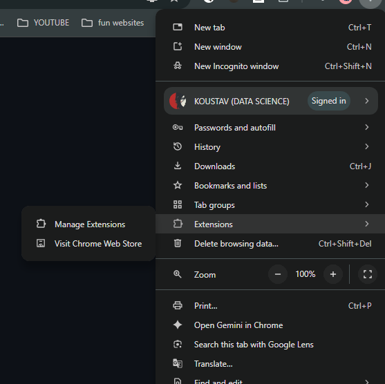
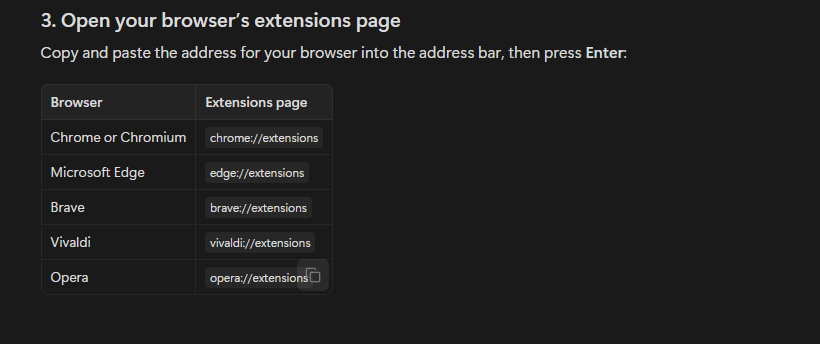

# Mochi

<p align="center">
  
</p>

<p align="center">
  <strong>A tiny cat for every browser tab :3</strong><br>
  A small, local-first browser companion for a slightly less sterile internet.
</p>

<p align="center">
  <a href="https://github.com/koustavdatascience/mochi">Repository</a> ·
  <a href="https://github.com/koustavdatascience/mochi/issues">Issues</a> ·
  <a href="https://github.com/koustavdatascience">Koustav Roy</a>
</p>

<p align="center">
  
  
</p>

## What is Mochi?

Mochi is a lightweight Chromium extension that places a tiny animated cat on the pages you browse. Pick a style, drag it into a corner, and let it quietly keep you company while you work, study, watch, or wander around the web.


<p align="center">
  
  
  
</p>

<p align="center">
  
</p>

<p align="center">
  
</p>

## Quick start

You do not need Git or any programming knowledge to install Mochi. The easiest method is to download the project as a ZIP file and add it to your browser.

### 1. Download Mochi

Open the [Mochi GitHub repository](https://github.com/koustavdatascience/mochi), click the green **Code** button, and choose **Download ZIP**.

### 2. Extract the ZIP file

Open your computer’s **Downloads** folder and find the file named something like `mochi-main.zip`. Double-click it and extract or copy the folder somewhere easy to find, such as your Desktop or Documents folder.

Make sure you select the extracted folder, not the ZIP file, in the next step.

### 3. Open your browser’s extensions page

The easiest way is to open your browser menu by clicking the **three dots** in the top-right corner. Then choose **Extensions** and **Manage Extensions**, as shown below.

<p align="center">
  
</p>

If you prefer, you can also copy and paste one of these addresses into your browser’s address bar:

* **Chrome or Chromium:** `chrome://extensions`
* **Microsoft Edge:** `edge://extensions`
* **Brave:** `brave://extensions`
* **Vivaldi:** `vivaldi://extensions`
* **Opera:** `opera://extensions`

Here is a quick visual reference for the browser addresses:

<p align="center">
  
</p>

### 4. Enable Developer mode

Find the **Developer mode** switch, usually near the top right of the extensions page, and turn it on.

### 5. Add Mochi

Click **Load unpacked** and select the extracted Mochi folder. Choose the folder that contains `manifest.json` directly inside it. If you see a folder named `mochi-main`, open it and select that folder.

Mochi should now appear in your list of installed extensions.

### 6. Start using Mochi

Open a normal website, click the **Extensions** button in your browser’s toolbar, and select Mochi. Choose your favorite cat and switch on **Show cat**.

You can drag Mochi to a different corner of the page. Your selected cat and position will be remembered across your tabs.

### Troubleshooting

If Mochi does not appear, check that you selected the extracted folder and not the ZIP file. The selected folder should contain `manifest.json`, `background.js`, and `popup.html`.

If the cat is not visible, open the Mochi popup and make sure **Show cat** is enabled. You may also need to refresh the webpage after installing the extension.

Some browser pages, including browser settings, extension stores, and new tab pages, may not allow extensions to display content. Try opening a regular website instead.

Mochi is designed for Chromium-based browsers. It is documented for Chrome, Chromium, and Microsoft Edge, and should also work in other Chromium-based browsers such as Brave, Vivaldi, and Opera. Firefox and Safari are not supported as-is.

> If you get stuck, send a message through the Mochi Product Hunt page or [open an issue on GitHub](https://github.com/koustavdatascience/mochi/issues). Include your browser name and a screenshot of the step where you got stuck.

### For developers

If you already use Git, you can clone the repository instead. This is not required for regular users.

```bash
git clone https://github.com/koustavdatascience/mochi.git
```

## Cat styles

Mochi includes **Bad Boy, Black Cat, Rolling Cat, Cream Cat, Frog Cat, Tiny Cat, Scarf Cat, Cat Roll, Blue Spinner, Yawning Cat, Pixel Cat, Blush Cat, Dancer, Meme Cat, Love Cat, Mewo, Sleepy Cat, White Kitty, Bleh Cat, and Paper Hat**.

<p align="center">
  
</p>

## Development

Mochi is a plain Manifest V3 extension made with HTML, CSS, JavaScript, and local assets. No build framework or package manager is required.

```text
manifest.json       extension metadata and permissions
background.js       shared state, storage, and tab recovery
content.js          on-page cat, dragging, injection guard, and sync
cat.css             isolated on-page cat styling
popup.html/css/js   popup structure, styling, and controls
assets/             official logo, icons, GIFs, and paused PNG frames
docs/               showcase sources and README screenshots
verify_extension.py local consistency checks
```

Run the checks before opening a pull request:

```bash
node --check content.js
node --check popup.js
node --check background.js
python3 verify_extension.py
```

To create a local ZIP:

```bash
zip -qr ../Mochi-extension.zip . -x '.git/*'
unzip -tq ../Mochi-extension.zip
```

### Technical details: privacy and permissions

Mochi stores only the preferences needed to keep the experience consistent. It does not upload page content, browsing history, images, or analytics data. The extension’s `scripting` permission and host access are used to restore Mochi in already-open eligible tabs; no remote content is fetched.

## Contributing

Small, focused contributions are welcome, especially new cat styles, accessibility improvements, browser-compatibility fixes, UI polish, and documentation updates. New cat styles should include both `.gif` and `.png` assets plus matching entries in `content.js`, `background.js`, `popup.html`, `README.md`, and `verify_extension.py`.

## Contact

For feedback or issues, email [koustavdatascience@gmail.com](mailto:koustavdatascience@gmail.com). 
## License

This is a personal side project. Review the repository before redistributing the extension or its bundled media assets.

