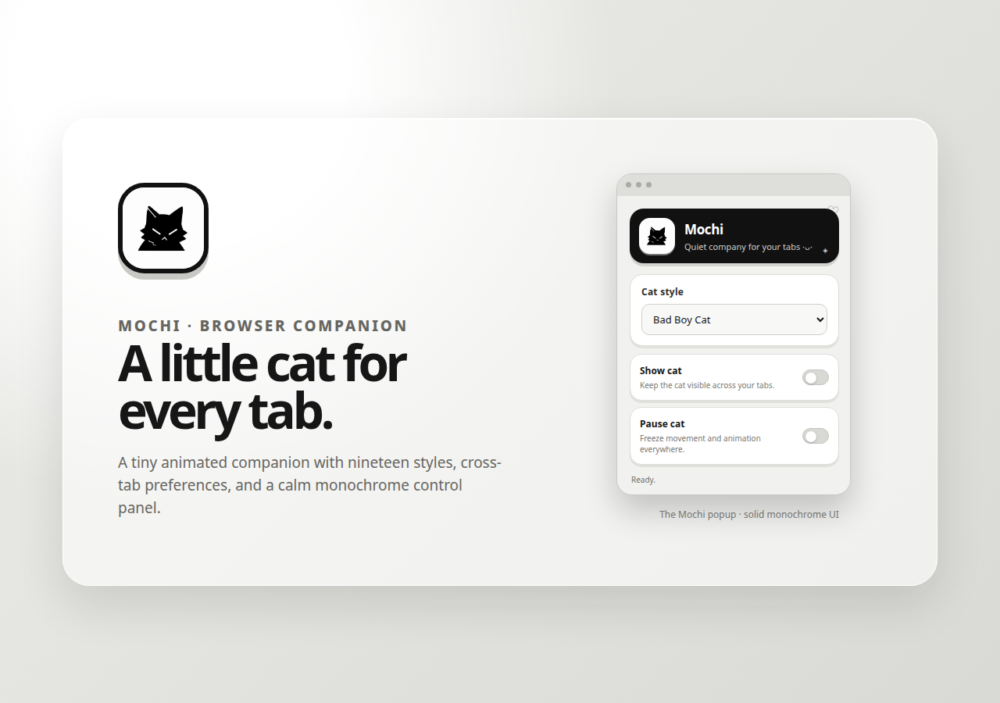
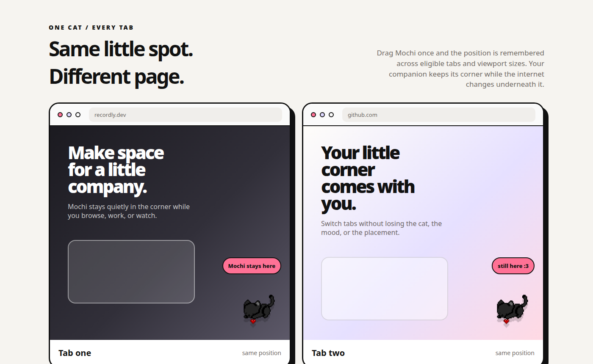

# Mochi

<p align="center">
  
</p>

<p align="center">
  <strong>A tiny cat for every browser tab :3</strong>
</p>

<p align="center">
  A small, local-first browser companion for people who like their digital spaces to feel a little more personal.
</p>

<p align="center">
  <a href="https://github.com/koustavdatascience/mochi">Repository</a> ·
  <a href="https://github.com/koustavdatascience/mochi/issues">Issues</a> ·
  <a href="https://github.com/koustavdatascience">Made by Koustav Roy</a>
</p>

<p align="center">
  
  
</p>

> Your tabs looked a little lonely. Mochi came to hang out.

## Quick Start

1. Clone or download this repository.
2. Open `chrome://extensions/` in Chrome or Chromium, or `edge://extensions/` in Microsoft Edge.
3. Enable **Developer mode**.
4. Click **Load unpacked** and select the folder that contains `manifest.json`.
5. Open a normal website and click the Mochi icon in your toolbar.

That’s it. Pick a cat, click **Show cat**, and Mochi will try to join the current eligible page without a manual refresh.

## Demo

<p align="center">
  
</p>

<p align="center">
  
</p>

## What is Mochi?

Mochi lets you place a small animated cat directly on the pages you browse. Like a tiny desk companion, it stays quietly in the corner while you work, study, watch, or wander around the web.

**What you can do:**

- Choose from nineteen small cat personalities.
- Drag Mochi anywhere on the visible page.
- Keep the same cat and position across eligible tabs.
- Show or hide Mochi everywhere from one popup control.
- Bring Mochi into the current page by clicking **Show cat**.
- Pause movement and animation whenever you need to focus.
- Use the extension without an account, feed, analytics, or network connection.


## Designed to stay out of your way :3

Mochi is intentionally small and a little unnecessary. It does not try to turn browsing into a productivity dashboard. There are no tasks, reminders, notifications, social features, or busy settings pages.

Drag the cat once and its position is saved as a normalized viewport placement. When you switch to another eligible tab, Mochi keeps the same relative spot even if the page has a different layout or viewport size. The popup’s **Show cat** control also attempts to inject Mochi into the active eligible tab directly.

## Privacy-first by design

Mochi does not require an account or sign-up. It does not include analytics, advertising, tracking pixels, remote APIs, or a server-side data store. The logo, cat animations, paused frames, popup, and extension logic are shipped locally in this repository.

Only the small set of preferences needed to keep Mochi consistent is stored in the browser’s local extension storage. The project has no reason to upload page content, images, or browsing history.

## Who it’s for

Mochi is made for remote workers, students, developers, digital desk decorators, and anyone who wants their browser to feel a little less sterile. It is lightweight, free to use, and deliberately not very serious.

## Installation

### From source

Clone the repository:

```bash
git clone https://github.com/koustavdatascience/mochi.git
cd mochi
```

Then load it in a Chromium-based browser:

- Open [`chrome://extensions`](chrome://extensions), [`edge://extensions`](edge://extensions), or the equivalent extensions page.
- Enable **Developer mode**.
- Click **Load unpacked**.
- Select the `mochi` directory directly — the selected folder must contain `manifest.json`.
- Open a regular website and click Mochi’s toolbar icon.

Chrome’s unpacked-extension workflow is described in the official extension guide.[1] Microsoft Edge provides a similar local-loading workflow.[3]

### Updating

Pull the latest changes and click **Reload** on the Mochi card in the extensions page. Mochi attempts to restore itself into already-open eligible tabs after an update or browser startup. A page refresh may still be needed for a page that was open before the extension was first installed or for a protected page that has not granted access.

## Usage

### Choosing a cat

Open the Mochi popup and select one of the nineteen styles. The selected style is shared across eligible tabs.

### Showing or hiding Mochi

Use **Show cat** to toggle visibility everywhere. When switched on, Mochi also asks the current eligible tab to inject the cat immediately, so you normally do not need to refresh that page.

### Moving Mochi

Click and drag the cat on the page. Its normalized position is saved and broadcast to other eligible tabs, keeping Mochi in the same relative place as you browse.

### Pausing Mochi

Use **Pause cat** to freeze the current frame and stop movement. The pause state is shared across eligible tabs as well.

## Cat styles

Mochi currently includes **Bad Boy, Black Cat, Rolling Cat, Cream Cat, Frog Cat, Tiny Cat, Scarf Cat, Cat Roll, Blue Spinner, Yawning Cat, Pixel Cat, Blush Cat, Dancer, Meme Cat, Love Cat, Mewo, Sleepy Cat, White Kitty, and Bleh Cat**.

Every style includes a local animated GIF and a matching paused PNG frame:

```text
assets/<style>.gif   # animated version
assets/<style>.png   # paused first-frame version
```

## Browser limitations

Mochi targets Manifest V3-compatible Chromium browsers and regular web pages. Browsers intentionally restrict extensions from injecting into their own protected surfaces, so Mochi will not appear on pages such as `chrome://extensions`, the Chrome Web Store, or other browser-owned UI pages.

The extension uses local storage for preferences and the `scripting` capability plus host access to recover Mochi in already-open eligible tabs. It does not fetch remote content.

## Development

Mochi is a plain Manifest V3 extension made from HTML, CSS, JavaScript, and local image assets. It does not require a build framework or package manager.

```text
manifest.json          extension metadata and permissions
background.js          shared state, storage, and tab recovery
content.js             on-page cat, dragging, injection guard, and sync
cat.css                on-page cat styling
popup.html              popup structure and controls
popup.css               monochrome Mochi popup styling
popup.js                popup events and background messaging
assets/                 logo, icons, GIFs, and paused PNG frames
docs/screenshots/       README showcase images
verify_extension.py     local consistency checks
```

Run the local checks before opening a pull request:

```bash
node --check content.js
node --check popup.js
node --check background.js
python3 verify_extension.py
```

To package the extension for local sharing:

```bash
zip -qr ../Mochi-extension.zip . -x '.git/*'
unzip -tq ../Mochi-extension.zip
```

The repository also contains the HTML sources used to create the showcase images in `docs/`. They can be rerendered with a Chromium headless screenshot workflow when the UI changes.

## Contributing

Small improvements are welcome, especially new cat styles, accessibility refinements, browser-compatibility fixes, UI polish, and documentation improvements. Please keep contributions focused and preserve Mochi’s lightweight, local-first character.

New cat styles should include both an animated `.gif` and a paused `.png` frame, plus matching entries in `content.js`, `background.js`, `popup.html`, `README.md`, and `verify_extension.py`.

## License

This project is maintained as a small personal side project. Review the repository before redistributing it or its bundled media assets.

## Contact

For questions, ideas, or feedback, open an [issue](https://github.com/koustavdatascience/mochi/issues), email [koustavdatascience@gmail.com](mailto:koustavdatascience@gmail.com), or visit [Koustav Roy’s GitHub profile](https://github.com/koustavdatascience).

---

**Mochi — make your browsing space feel a little more alive :3**

## References

[1]: https://developer.chrome.com/docs/extensions/get-started/tutorial/hello-world "Chrome Extensions: Hello World tutorial"

[2]: https://developer.chrome.com/docs/extensions/develop/migrate/what-is-mv3 "Chrome Extensions: What is Manifest V3?"

[3]: https://learn.microsoft.com/en-us/microsoft-edge/extensions/getting-started/part1-simple-extension "Microsoft Edge extensions: Build a simple extension"
