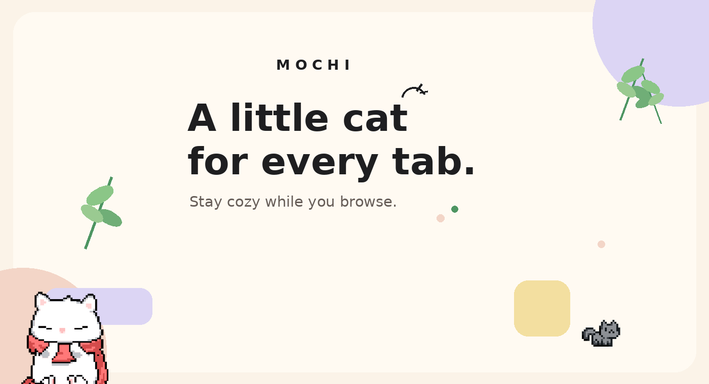
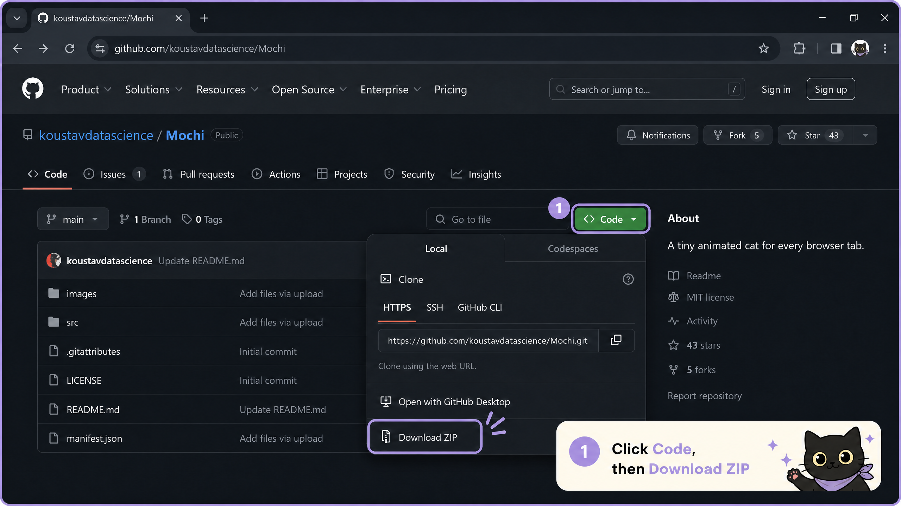
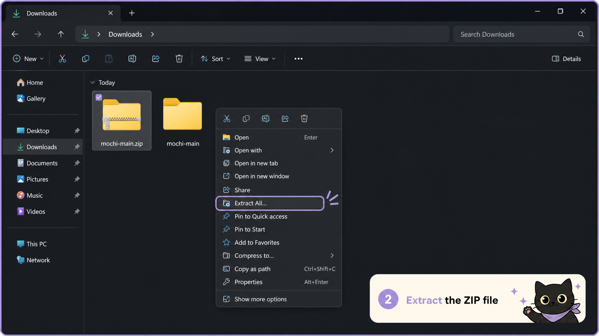
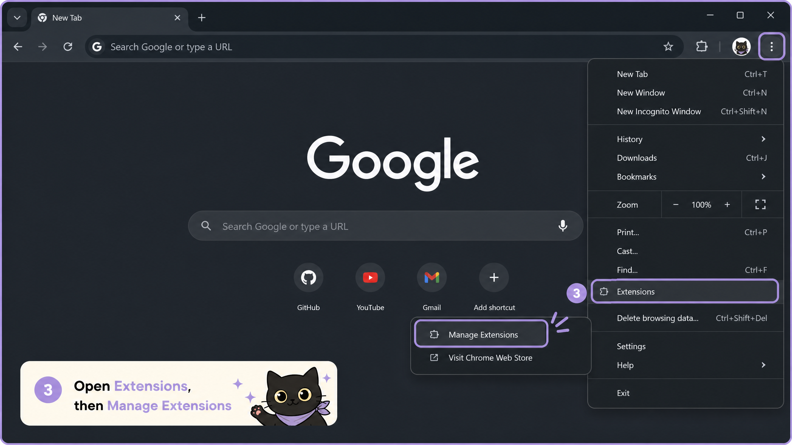
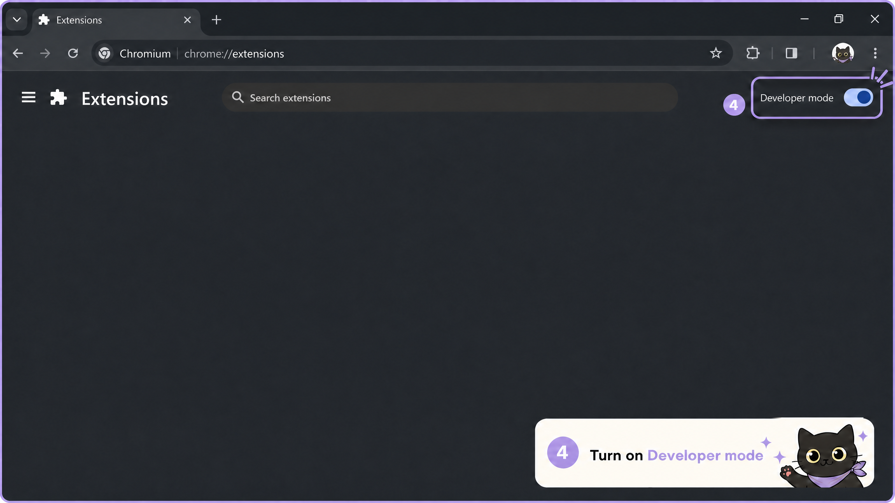
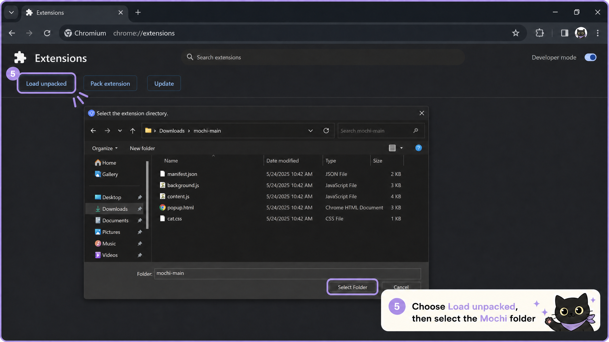
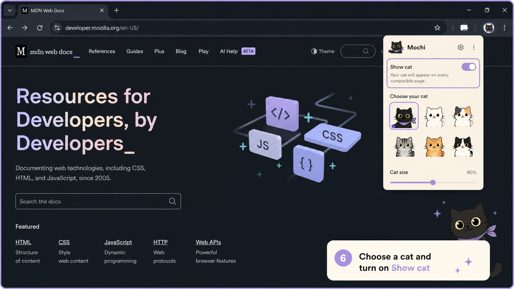

# Mochi

<p align="center">
  
</p>

<p align="center">
  <strong>A tiny cat for every browser tab :3</strong><br>
  A small, local-first browser companion for a slightly less sterile internet.
</p>

<p align="center">
  <a href="https://github.com/koustavdatascience/mochi">Repository</a> ·
  <a href="https://github.com/koustavdatascience/mochi/issues">Issues</a> ·
  <a href="https://github.com/koustavdatascience">Koustav Roy</a>
</p>

<p align="center">
  
  
</p>

## What is Mochi?

Mochi is a lightweight Chromium extension that places a tiny animated cat on the pages you browse. Pick a style, drag it into a corner, and let it quietly keep you company while you work, study, watch, or wander around the web.


<p align="center">
  
  
  
</p>

<p align="center">
  
</p>

<p align="center">
  
</p>

## Quick start

You do not need Git or any programming knowledge to install Mochi. The easiest method is to download the project as a ZIP file and add it to your browser.

### 1. Download Mochi from GitHub

Open the [Mochi GitHub repository](https://github.com/koustavdatascience/mochi). Click the green **Code** button, then click **Download ZIP**.

<p align="center">
  
</p>

You do not need to clone the repository or install Git. The ZIP download is the easiest option for most people.

### 2. Extract the downloaded ZIP file

Open your computer’s **Downloads** folder and find `mochi-main.zip`. Right-click it and choose **Extract All**. This creates a new folder named `mochi-main`.

<p align="center">
  
</p>

Keep the extracted `mochi-main` folder somewhere easy to find, such as your Desktop or Documents folder. Do not select the ZIP file itself when installing Mochi.

### 3. Open your browser’s extensions page

Open your browser menu by clicking the **three dots** in the top-right corner. Choose **Extensions**, then **Manage Extensions**.

<p align="center">
  
</p>

If your browser menu looks different, you can paste one of these addresses into the address bar:

* **Chrome or Chromium:** `chrome://extensions`
* **Microsoft Edge:** `edge://extensions`
* **Brave:** `brave://extensions`
* **Vivaldi:** `vivaldi://extensions`
* **Opera:** `opera://extensions`

### 4. Turn on Developer mode

On the extensions page, find the **Developer mode** switch near the top-right corner and turn it on.

<p align="center">
  
</p>

At this point, the extensions page will still be empty. Mochi will appear only after you complete the next step.

### 5. Load the Mochi folder

Click **Load unpacked**. In the folder window, open the extracted `mochi-main` folder and select the folder that contains `manifest.json`.

<p align="center">
  
</p>

After you select the folder, Mochi should appear in your list of installed extensions. This is the moment when Mochi is installed in your browser.

### 6. Choose your cat and start using Mochi

Open a normal website, click the **Extensions** button in your browser’s toolbar, and select Mochi. Choose your favorite cat and turn on **Show cat**.

<p align="center">
  
</p>

You can drag Mochi to a different corner of the page. Your selected cat and position will be remembered across your tabs.

### Troubleshooting

If Mochi does not work, first reload the webpage.

If it still does not work, open your browser’s extensions page, remove Mochi, and load the extracted folder again with **Load unpacked**.

If the problem continues or your browser is not compatible, email [koustavdatascience@gmail.com](mailto:koustavdatascience@gmail.com).

### For developers

If you already use Git, you can clone the repository instead. This is not required for regular users.

```bash
git clone https://github.com/koustavdatascience/mochi.git
```

## Cat styles

Mochi includes **Bad Boy, Black Cat, Rolling Cat, Cream Cat, Frog Cat, Tiny Cat, Scarf Cat, Cat Roll, Blue Spinner, Yawning Cat, Pixel Cat, Blush Cat, Dancer, Meme Cat, Love Cat, Mewo, Sleepy Cat, White Kitty, Bleh Cat, and Paper Hat**.

<p align="center">
  
</p>

## Development

Mochi is a plain Manifest V3 extension made with HTML, CSS, JavaScript, and local assets. No build framework or package manager is required.

```text
manifest.json       extension metadata and permissions
background.js       shared state, storage, and tab recovery
content.js          on-page cat, dragging, injection guard, and sync
cat.css             isolated on-page cat styling
popup.html/css/js   popup structure, styling, and controls
assets/             official logo, icons, GIFs, and paused PNG frames
docs/               showcase sources and README screenshots
verify_extension.py local consistency checks
```

Run the checks before opening a pull request:

```bash
node --check content.js
node --check popup.js
node --check background.js
python3 verify_extension.py
```

To create a local ZIP:

```bash
zip -qr ../Mochi-extension.zip . -x '.git/*'
unzip -tq ../Mochi-extension.zip
```

### Technical details: privacy and permissions

Mochi stores only the preferences needed to keep the experience consistent. It does not upload page content, browsing history, images, or analytics data. The extension’s `scripting` permission and host access are used to restore Mochi in already-open eligible tabs; no remote content is fetched.

## Contributing

Small, focused contributions are welcome, especially new cat styles, accessibility improvements, browser-compatibility fixes, UI polish, and documentation updates. New cat styles should include both `.gif` and `.png` assets plus matching entries in `content.js`, `background.js`, `popup.html`, `README.md`, and `verify_extension.py`.

## Contact

For feedback or issues, email [koustavdatascience@gmail.com](mailto:koustavdatascience@gmail.com). 
## License

This is a personal side project. Review the repository before redistributing the extension or its bundled media assets.

